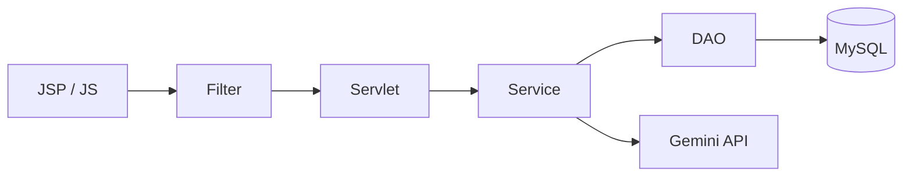
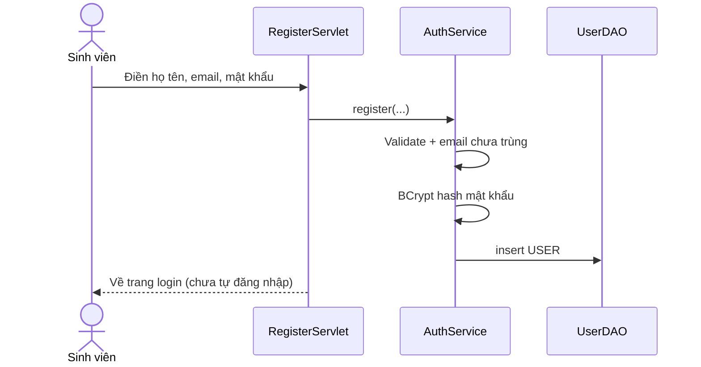
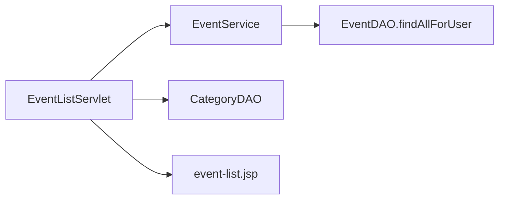
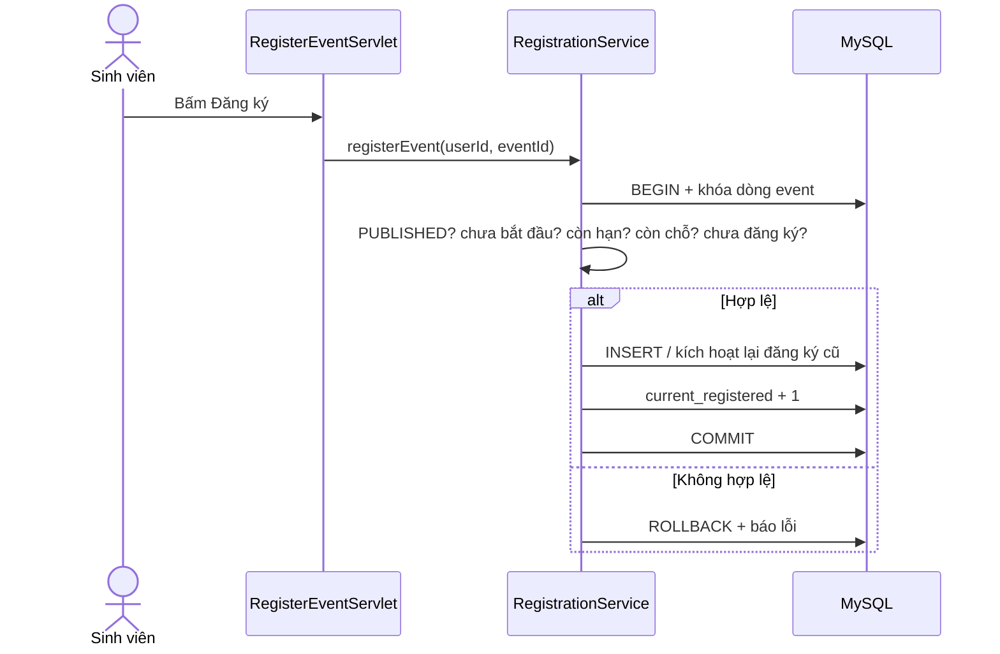
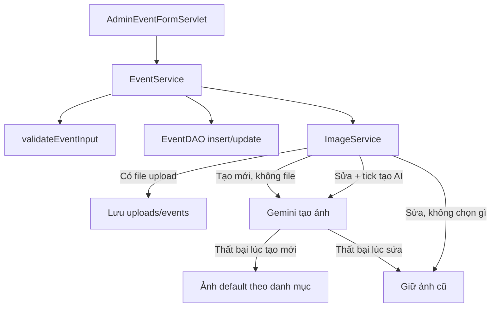
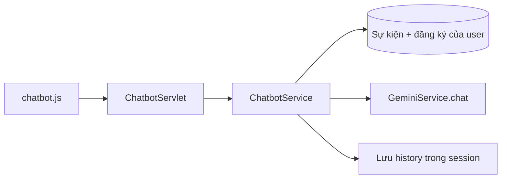

# EventHub AI — Luồng hoạt động

Tài liệu này dùng để **trình bày với thầy**: mỗi chức năng đi từ màn hình → servlet → service → DAO, kèm đường dẫn file trong project.

Quy ước: request luôn đi **một chiều** như dưới đây. Servlet không viết SQL; JSP không chứa nghiệp vụ.

```
Trình duyệt  →  Filter  →  Servlet  →  Service  →  DAO  →  MySQL
                                ↓
                              JSP (HTML)
```

---

## 1. Kiến trúc tổng quát



| Lớp | Việc làm | Thư mục |
|---|---|---|
| Giao diện | Form, bảng, chatbot | `src/main/webapp/WEB-INF/views/` |
| Filter | UTF-8, bắt buộc login, chỉ Admin vào `/admin` | `.../filter/` |
| Servlet | Đọc param, gọi service, forward/redirect | `.../servlet/` |
| Service | Validate, transaction, gọi AI | `.../service/` |
| DAO | JDBC / PreparedStatement | `.../dao/` |
| Model | `User`, `Event`, `Registration`, `Review`, `Category` | `.../model/` |

Khi Tomcat bật app:

1. `AppContextListener` tạo thư mục ảnh + mở pool HikariCP  
   `src/main/java/com/eventhub/config/AppContextListener.java`
2. `DBConnection` đọc `DB_URL`, `DB_USERNAME`, `DB_PASSWORD`  
   `src/main/java/com/eventhub/config/DBConnection.java`
3. `UploadConfig` trỏ thư mục `src/main/webapp/uploads`  
   `src/main/java/com/eventhub/config/UploadConfig.java`

Trang gốc `index.jsp`: Admin → dashboard; còn lại → danh sách sự kiện.

---

## 2. Ai được vào trang nào?

```mermaid
flowchart TD
  R[Request] --> F0[CharacterEncodingFilter UTF-8]
  F0 --> P{URL?}
  P -->|/auth/* /events /api/chatbot| Pub[Công khai]
  P -->|/user/*| AF[AuthFilter]
  P -->|/admin/*| AF
  AF -->|Chưa login| L[/auth/login]
  AF -->|Đã login /user/*| UserOK[Vào trang user]
  AF -->|Đã login /admin/*| AD[AdminFilter]
  AD -->|Không phải ADMIN| E403[403]
  AD -->|ADMIN| AdminOK[Vào trang admin]
```

| Filter | File | Áp dụng |
|---|---|---|
| UTF-8 tiếng Việt | `filter/CharacterEncodingFilter.java` | Mọi URL |
| Phải đăng nhập | `filter/AuthFilter.java` | `/user/*`, `/admin/*` |
| Phải là ADMIN | `filter/AdminFilter.java` | `/admin/*` |

Session lưu user tại key `loggedInUser`. Hết hạn 30 phút (`WEB-INF/web.xml`).

---

## 3. Đăng ký / Đăng nhập / Đăng xuất

### 3.1. Đăng ký tài khoản mới

```
GET/POST /auth/register
```



| Bước | File |
|---|---|
| Form | `webapp/WEB-INF/views/auth/register.jsp` |
| Nhận form | `servlet/auth/RegisterServlet.java` |
| Nghiệp vụ | `service/AuthService.java` |
| Hash | `util/PasswordUtil.java` |
| Lưu DB | `dao/UserDAO.java` |

Quy tắc: role luôn là `USER`. Admin không tự đăng ký từ form này.

### 3.2. Đăng nhập

```
GET/POST /auth/login
```

| Bước | File |
|---|---|
| Form | `views/auth/login.jsp` |
| Xử lý | `servlet/auth/LoginServlet.java` |
| So khớp BCrypt | `service/AuthService.java` → `UserDAO` |

Sau khi đúng mật khẩu: **hủy session cũ**, tạo session mới (tránh session fixation), rồi:

- Nếu trước đó bị chặn vì chưa login → quay lại URL cũ (`redirectAfterLogin`)
- Admin → `/admin/dashboard`
- User → `/events`

### 3.3. Đăng xuất

`servlet/auth/LogoutServlet.java` (`/auth/logout`) — `session.invalidate()`.

---

## 4. Sinh viên xem và đăng ký sự kiện

### 4.1. Danh sách sự kiện (cả khách)

```
GET /events?keyword=&categoryId=&page=
```



| File | Vai trò |
|---|---|
| `servlet/user/EventListServlet.java` | Đọc filter, phân trang |
| `dto/EventFilterDTO.java` | keyword, category, page |
| `service/EventService.java` | Gọi DAO |
| `dao/EventDAO.java` | Chỉ lấy sự kiện **PUBLISHED** |
| `views/user/event-list.jsp` | Card + tìm kiếm |
| `assets/js/main.js` | UX (dark mode, confirm, …) |

### 4.2. Chi tiết sự kiện

```
GET /events/detail?id={id}
```

| File | Vai trò |
|---|---|
| `servlet/user/EventDetailServlet.java` | Load sự kiện, đăng ký của user, review, sự kiện tương tự |
| `views/user/event-detail.jsp` | Banner, nút Đăng ký / Hủy, form đánh giá |

User đã login thì servlet hỏi `RegistrationService` xem đã đăng ký chưa, để hiện đúng nút.

### 4.3. Đăng ký sự kiện

```
POST /user/register-event   (cần login)
```

Đây là luồng **cần giải thích kỹ**: nhiều người bấm cùng lúc có thể vượt sức chứa. Code khóa dòng sự kiện (`SELECT FOR UPDATE`) trong 1 transaction.



| File | Vai trò |
|---|---|
| `servlet/user/RegisterEventServlet.java` | Lấy `eventId` + user session |
| `service/RegistrationService.java` | Toàn bộ rule + transaction |
| `dao/EventDAO.java` | `findByIdForUpdate`, `incrementRegistered` |
| `dao/RegistrationDAO.java` | insert / reactivate |
| `config/DBConnection.java` | `inTransaction(...)` |

**Rule đăng ký (nói với thầy 4 ý):**

1. Sự kiện phải `PUBLISHED`, chưa bắt đầu, chưa hết hạn đăng ký, còn chỗ  
2. Đã `REGISTERED` thì không đăng ký lại  
3. Đã `CANCELLED` thì được đăng ký lại (đổi status, không tạo dòng mới — unique user–event)  
4. Tăng `current_registered` cùng transaction

### 4.4. Hủy đăng ký

```
POST /user/cancel-event
```

| File | Vai trò |
|---|---|
| `servlet/user/CancelEventServlet.java` | Nhận form |
| `RegistrationService.cancelRegistration` | Chỉ hủy khi sự kiện **chưa bắt đầu** |
| `RegistrationDAO.cancel` + `EventDAO.decrementRegistered` | Đổi status, giảm chỗ |

### 4.5. Sự kiện của tôi

```
GET /user/my-events
```

| File | Vai trò |
|---|---|
| `servlet/user/MyEventsServlet.java` | Tách 3 list: upcoming / attended / cancelled |
| `views/user/my-events.jsp` | 3 tab |
| `assets/css/style.css` (phần `.my-events-*`) | Giao diện trang này |

### 4.6. Đánh giá

```
POST /user/submit-review
```

Chỉ khi: đã `REGISTERED`, sự kiện **đã kết thúc**, chưa hủy, **chưa review lần nào**.

| File | Vai trò |
|---|---|
| `servlet/user/SubmitReviewServlet.java` | rating + comment |
| `service/ReviewService.java` | Rule + transaction |
| `dao/ReviewDAO.java` | insert |
| `EventDAO.updateRating` | Cập nhật `avg_rating`, `total_reviews` |

---

## 5. Quản trị sự kiện

Mọi URL `/admin/*` đều qua `AuthFilter` + `AdminFilter`.

### 5.1. Dashboard

```
GET /admin/dashboard
```

`servlet/admin/DashboardServlet.java` → `service/DashboardService.java` → `dao/DashboardDAO.java` → `views/admin/dashboard.jsp`

### 5.2. Danh sách / xóa-hủy sự kiện

```
GET  /admin/events
POST /admin/events/delete
```

| File | Vai trò |
|---|---|
| `AdminEventListServlet.java` | Tất cả trạng thái, có lọc |
| `views/admin/event-list.jsp` | Bảng quản lý |
| `AdminEventDeleteServlet.java` | Gọi `EventService.deleteEvent` |

Xóa thật nếu **0 người đăng ký**; nếu còn người thì **hủy sự kiện + hủy đăng ký** (không xóa lịch sử).

### 5.3. Tạo / sửa sự kiện (luồng ảnh)

```
GET/POST /admin/events/create
GET/POST /admin/events/edit
```



| File | Vai trò |
|---|---|
| `servlet/admin/AdminEventFormServlet.java` | Parse form, `regenerateAi`, file `imageFile` |
| `views/admin/event-form.jsp` | Form + nút tóm tắt AI + tick tạo ảnh AI khi sửa |
| `service/EventService.java` | Validate thời gian, sức chứa |
| `service/ImageService.java` | Ưu tiên: **file > AI > default / giữ cũ** |
| `service/GeminiService.java` | Gọi model ảnh |
| `servlet/UploadServlet.java` | Phục vụ file `/uploads/*` |

**Validate thời gian (EventService) — nên nhắc khi demo:**

- Tạo mới: giờ bắt đầu ≥ hiện tại + 1 giờ; hạn đăng ký ở tương lai và ≤ giờ bắt đầu; giờ kết thúc > giờ bắt đầu  
- Không sửa sự kiện đã kết thúc / `COMPLETED` / `CANCELLED`  
- Sự kiện đã bắt đầu: không đổi giờ bắt đầu và hạn đăng ký  
- `max_participants` không nhỏ hơn số người đã đăng ký

### 5.4. Tóm tắt AI trên form

```
POST /api/ai/summary    (chỉ Admin)
```

`servlet/api/AISummaryServlet.java` → `GeminiService.generateSummary` → JSON `{ success, summary }`  
JS gọi từ `event-form.jsp`.

### 5.5. Danh mục & danh sách đăng ký

| URL | Servlet | View |
|---|---|---|
| `/admin/categories` | `AdminCategoryServlet.java` | `admin/category-list.jsp` |
| `/admin/events/registrations` | `AdminRegistrationsServlet.java` | `admin/registrations.jsp` |

---

## 6. Chatbot

```
POST /api/chatbot     (không bắt buộc login)
```



| File | Vai trò |
|---|---|
| `views/common/chatbot.jsp` + `assets/js/chatbot.js` + `assets/css/chatbot.css` | Widget |
| `servlet/api/ChatbotServlet.java` | JSON in/out |
| `service/ChatbotService.java` | Prompt + lịch sử session + context sự kiện |
| `GeminiService.chat` | Gọi model text |

Guest vẫn chat được. User đã login thì prompt kèm sự kiện mình đã đăng ký để câu trả lời sát hơn.

---

## 7. Bảng URL (tra cứu nhanh khi demo)

| URL | Ai dùng | Servlet |
|---|---|---|
| `/auth/login` | Tất cả | `LoginServlet` |
| `/auth/register` | Khách | `RegisterServlet` |
| `/auth/logout` | Đã login | `LogoutServlet` |
| `/events` | Công khai | `EventListServlet` |
| `/events/detail` | Công khai | `EventDetailServlet` |
| `/user/my-events` | USER/ADMIN | `MyEventsServlet` |
| `/user/register-event` | Đã login | `RegisterEventServlet` |
| `/user/cancel-event` | Đã login | `CancelEventServlet` |
| `/user/submit-review` | Đã login | `SubmitReviewServlet` |
| `/admin/dashboard` | ADMIN | `DashboardServlet` |
| `/admin/events` | ADMIN | `AdminEventListServlet` |
| `/admin/events/create` `/edit` | ADMIN | `AdminEventFormServlet` |
| `/admin/events/delete` | ADMIN | `AdminEventDeleteServlet` |
| `/admin/categories` | ADMIN | `AdminCategoryServlet` |
| `/admin/events/registrations` | ADMIN | `AdminRegistrationsServlet` |
| `/api/ai/summary` | ADMIN | `AISummaryServlet` |
| `/api/chatbot` | Công khai | `ChatbotServlet` |
| `/uploads/*` | Công khai | `UploadServlet` |

---

## 8. Gợi ý thứ tự trình bày (5–7 phút)

1. **Bài toán:** sinh viên khó theo dõi sự kiện; admin nhập tay nhiều.  
2. **Kiến trúc 4 lớp** (mục 1) — chỉ 1 slide.  
3. **Bảo mật:** BCrypt + Filter login/admin + session mới khi login.  
4. **Đăng ký sự kiện:** transaction + khóa dòng, rule hạn/chỗ (mục 4.3).  
5. **Admin + AI:** tóm tắt, poster, chatbot; AI lỗi thì app không chết.  
6. **Demo live:** login user → đăng ký; login admin → tạo sự kiện / chatbot.

Cài máy và biến môi trường: xem [huong-dan-cai-dat.md](huong-dan-cai-dat.md).
